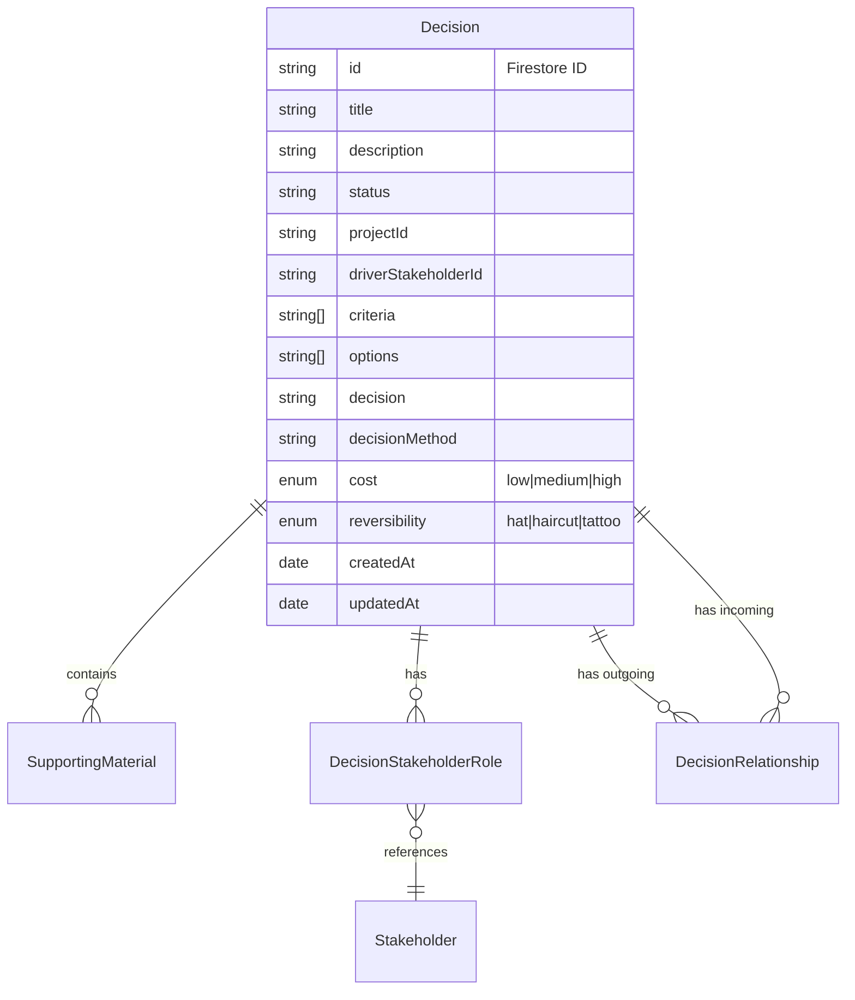

# Decision Domain Model

## Overview

The Decision is a core entity that represents a structured decision-making process within a project. Decisions follow a defined workflow and can involve multiple stakeholders with different roles. Decisions can be related to each other through blocking/enabling relationships and supersession relationships.

### Domain Model Relationships



## Domain Model

```typescript
type DecisionRelationshipType = "blocks" | "supersedes";

interface DecisionRelationship {
  fromDecisionId: string;
  toDecisionId: string;
  type: DecisionRelationshipType;
  createdAt: Date;
}

interface DecisionProps {
  id: string;
  title: string;
  description: string;
  cost: "low" | "medium" | "high";
  createdAt: Date;
  criteria: string[];
  options: string[];
  decision?: string;
  decisionMethod?: string;
  reversibility: "hat" | "haircut" | "tattoo";
  stakeholders: DecisionStakeholderRole[];
  status: string;
  updatedAt?: Date;
  driverStakeholderId: string;
  supportingMaterials?: SupportingMaterial[];
  // New relationship arrays
  blockedByDecisionIds: string[];
  supersededByDecisionId?: string;
}

class Decision {
  // Core properties
  readonly id: string
  readonly title: string
  readonly description: string
  readonly cost: Cost
  readonly reversibility: Reversibility
  readonly status: string
  readonly driverStakeholderId: string

  // Workflow properties
  readonly criteria: string[]
  readonly options: string[]
  readonly decision?: string
  readonly decisionMethod?: string
  
  // Stakeholder management
  readonly stakeholders: DecisionStakeholderRole[]
  readonly supportingMaterials: SupportingMaterial[]
  
  // Timestamps
  readonly createdAt: Date
  readonly updatedAt?: Date

  // Relationship properties
  readonly blockedByDecisionIds: string[]
  readonly supersededByDecisionId?: string

  // Relationship methods
  isBlockedBy(decisionId: string): boolean {
    return this.blockedByDecisionIds.includes(decisionId)
  }

  canProceed(completedDecisionIds: string[]): boolean {
    return this.blockedByDecisionIds.every(id => completedDecisionIds.includes(id))
  }

  isSuperseded(): boolean {
    return !!this.supersededByDecisionId
  }

  // Factory methods for relationships
  addBlockingDecision(blockingDecisionId: string): Decision {
    if (this.blockedByDecisionIds.includes(blockingDecisionId)) {
      return this
    }

    return this.with({
      blockedByDecisionIds: [...this.blockedByDecisionIds, blockingDecisionId]
    })
  }

  removeBlockingDecision(blockingDecisionId: string): Decision {
    return this.with({
      blockedByDecisionIds: this.blockedByDecisionIds.filter(id => id !== blockingDecisionId)
    })
  }

  markAsSupersededBy(newDecisionId: string): Decision {
    return this.with({
      supersededByDecisionId: newDecisionId,
      status: 'superseded'
    })
  }
}
```

## Key Concepts

### Decision Workflow
- Decisions follow a 5-step workflow:
  1. Identify
  2. Method
  3. Options
  4. Choose
  5. Publish
- The current step is determined by the decision's state
- Progress through steps is tracked via the properties populated

### Stakeholder Roles
```typescript
type StakeholderRole = "decider" | "advisor" | "observer"

interface DecisionStakeholderRole {
  stakeholder_id: string
  role: StakeholderRole
}
```
- Each decision has one driver stakeholder
- Stakeholders can have one of three roles:
  - Decider: Can make the final decision
  - Advisor: Can provide input
  - Observer: Can view the decision

### Cost and Reversibility
- Decisions are classified by their cost impact: low, medium, high
- Reversibility is categorized as:
  - Hat: Easily reversible
  - Haircut: Moderately reversible
  - Tattoo: Difficult to reverse

### Decision Relationships

#### Blocking/Enabling Relationships
- A decision can be blocked by zero or more other decisions
- A decision cannot proceed until all blocking decisions are completed
- Circular blocking relationships are prevented at the repository level
- When a blocking decision is completed, it enables the blocked decisions to proceed

#### Supersession Relationships
- A decision can be superseded by exactly one other decision
- A decision can supersede multiple other decisions
- When a decision is superseded, it is marked with a 'superseded' status
- Circular supersession relationships are prevented at the repository level

## Repository Interface

```typescript
interface DecisionScope {
  organisationId: string
  teamId: string
  projectId: string
}

interface DecisionsRepository {
  getAll(scope: DecisionScope): Promise<Decision[]>
  getById(id: string, scope: DecisionScope): Promise<Decision | null>
  create(initialData: Partial<Omit<DecisionProps, "id">>, scope: DecisionScope): Promise<Decision>
  update(decision: Decision, scope: DecisionScope): Promise<void>
  delete(id: string, scope: DecisionScope): Promise<void>
  subscribeToAll(onData: (decisions: Decision[]) => void, onError: (error: Error) => void, scope: DecisionScope): () => void
  subscribeToOne(id: string, onData: (decision: Decision | null) => void, onError: (error: Error) => void, scope: DecisionScope): () => void

  // Relationship methods
  addBlockingRelationship(blockingDecisionId: string, blockedDecisionId: string, scope: DecisionScope): Promise<void>
  removeBlockingRelationship(blockingDecisionId: string, blockedDecisionId: string, scope: DecisionScope): Promise<void>
  markAsSuperseded(oldDecisionId: string, newDecisionId: string, scope: DecisionScope): Promise<void>
  
  // Query methods
  getBlockedDecisions(blockingDecisionId: string, scope: DecisionScope): Promise<Decision[]>
  getBlockingDecisions(blockedDecisionId: string, scope: DecisionScope): Promise<Decision[]>
  getSupersededDecisions(supersedingDecisionId: string, scope: DecisionScope): Promise<Decision[]>
  getSupersedingDecision(supersededDecisionId: string, scope: DecisionScope): Promise<Decision | null>
}
```

## Firestore Structure

```sh
organisations/
  {organisationId}/
    decisionRelationships/  # Moved to org level to support cross-team/project relationships
      {relationshipId}      # Composite of fromDecisionId_toDecisionId
    teams/
      {teamId}/
        projects/
          {projectId}/
            decisions/
              {decisionId}
```

### Decision Document Structure
```typescript
interface FirestoreDecisionDocument {
  // ... existing fields ...
  blockedByDecisionIds: string[];  // Array of decision IDs that block this decision (can be from any team/project in org)
  supersededByDecisionId?: string;  // ID of the decision that supersedes this one (can be from any team/project in org)
  // Metadata to support cross-team/project relationships
  organisationId: string;  // Added to support quick lookups
  teamId: string;         // Added to support quick lookups
  projectId: string;      // Added to support quick lookups
}
```

### Decision Relationship Document Structure
```typescript
interface FirestoreDecisionRelationshipDocument {
  fromDecisionId: string;
  toDecisionId: string;
  type: "blocks" | "supersedes";
  createdAt: Timestamp;
  // Metadata to support cross-team/project relationships
  fromTeamId: string;
  fromProjectId: string;
  toTeamId: string;
  toProjectId: string;
}
```

## Repository Interface

```typescript
interface DecisionsRepository {
  // ... existing methods ...

  // Updated relationship methods with simplified scope (only need organisationId)
  addBlockingRelationship(
    blockingDecisionId: string, 
    blockedDecisionId: string, 
    organisationId: string
  ): Promise<void>;
  
  removeBlockingRelationship(
    blockingDecisionId: string, 
    blockedDecisionId: string, 
    organisationId: string
  ): Promise<void>;
  
  markAsSuperseded(
    oldDecisionId: string, 
    newDecisionId: string, 
    organisationId: string
  ): Promise<void>;
  
  // Updated query methods
  getBlockedDecisions(
    blockingDecisionId: string, 
    organisationId: string
  ): Promise<Decision[]>;
  
  getBlockingDecisions(
    blockedDecisionId: string, 
    organisationId: string
  ): Promise<Decision[]>;
  
  getSupersededDecisions(
    supersedingDecisionId: string, 
    organisationId: string
  ): Promise<Decision[]>;
  
  getSupersedingDecision(
    supersededDecisionId: string, 
    organisationId: string
  ): Promise<Decision | null>;
}
```

## Validation Rules

```typescript
// Firestore security rules
match /organisations/{orgId} {
  // Helper function to check if user can access a decision
  function canAccessDecision(decisionId) {
    let decision = get(/databases/$(database)/documents/organisations/$(orgId)/teams/*/projects/*/decisions/$(decisionId));
    return decision != null && 
           exists(/databases/$(database)/documents/stakeholderTeams/{stakeholderTeamId}
             where stakeholderTeamId == request.auth.uid 
             && organisationId == orgId
             && teamId == decision.data.teamId);
  }

  match /decisionRelationships/{relationshipId} {
    allow create: if
      // User must have access to both decisions
      canAccessDecision(request.resource.data.fromDecisionId) &&
      canAccessDecision(request.resource.data.toDecisionId) &&
      // Prevent self-referential relationships
      request.resource.data.fromDecisionId != request.resource.data.toDecisionId;
      
    allow read: if
      // User must have access to either the from or to decision
      canAccessDecision(resource.data.fromDecisionId) ||
      canAccessDecision(resource.data.toDecisionId);
  }
}
```

## Usage Examples

### Creating a Cross-Project Blocking Relationship
```typescript
// Decision B in Project 2 is blocked by Decision A in Project 1
await decisionsRepo.addBlockingRelationship(
  decisionA.id,  // from Project 1
  decisionB.id,  // from Project 2
  organisationId
);

// Check if Decision B can proceed
const decisionB = await decisionsRepo.getById(decisionBId, {
  organisationId,
  teamId: team2Id,
  projectId: project2Id
});
const canProceed = decisionB.canProceed([decisionA.id]);
```

## Business Rules

1. Decisions belong to exactly one project
2. Each decision must have exactly one driver stakeholder
3. The driver stakeholder cannot be removed from the decision
4. Stakeholders can only be added once with a specific role
5. Published decisions cannot be modified
6. Decision workflow steps must be followed in order
7. A decision cannot be blocked by itself (direct circular dependency)
8. Blocking relationships cannot form circular chains
9. A decision can only be superseded by one other decision
10. A decision marked as superseded cannot be modified
11. Supersession relationships cannot form circular chains
12. A decision cannot proceed until all blocking decisions are completed
13. Decisions can be related to other decisions within the same organisation, regardless of team or project
14. Users must have access to both decisions to create a relationship between them
15. Users can view relationships if they have access to either the source or target decision

## Error Handling

```typescript
// Handled through TypeScript type system and class methods
// Invalid operations (like removing driver) simply return unchanged decision
```