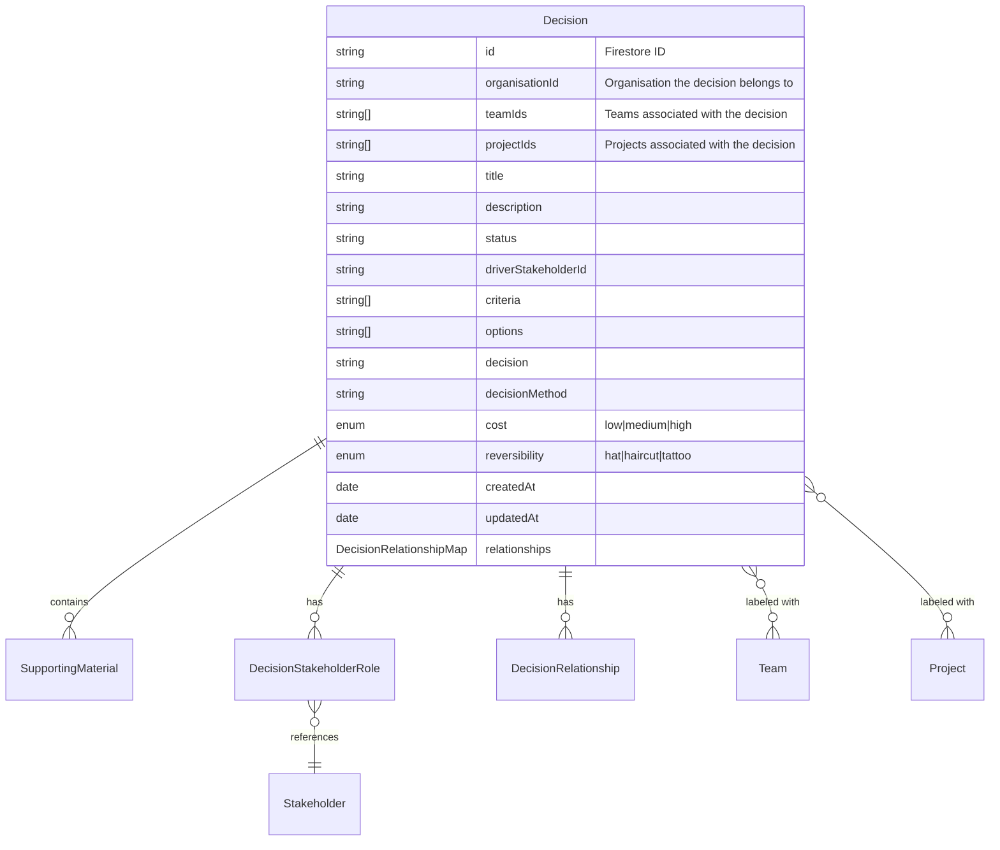

# Decision Domain Model

## Overview

The Decision is a core entity that represents a structured decision-making process within an organisation. Decisions follow a defined workflow and can involve multiple stakeholders with different roles. Decisions can be related to each other through blocking/enabling relationships and supersession relationships.

### Domain Model Relationships



## Domain Model

```typescript
type DecisionRelationshipType = "blocked_by" | "supersedes" | "blocks" | "superseded_by";

interface DecisionRelationship {
  targetDecision: DocumentReference;
  targetDecisionTitle: string;
  type: DecisionRelationshipType;
}

type DecisionRelationshipMap = {
  [key: string]: DecisionRelationship;
};

interface DecisionProps {
  id: string;
  title: string;
  description: string;
  cost: "low" | "medium" | "high";
  createdAt: Date;
  criteria: string[];
  options: string[];
  decision?: string;
  decisionMethod?: string;
  reversibility: "hat" | "haircut" | "tattoo";
  stakeholders: DecisionStakeholderRole[];
  status: string;
  updatedAt?: Date;
  driverStakeholderId: string;
  supportingMaterials?: SupportingMaterial[];
  organisationId: string;
  teamIds: string[]; // Multiple teams can be associated with a decision
  projectIds: string[]; // Multiple projects can be associated with a decision
  relationships?: DecisionRelationshipMap;
}

class Decision {
  // Core properties
  readonly id: string
  readonly title: string
  readonly description: string
  readonly cost: Cost
  readonly reversibility: Reversibility
  readonly status: string
  readonly driverStakeholderId: string

  // Workflow properties
  readonly criteria: string[]
  readonly options: string[]
  readonly decision?: string
  readonly decisionMethod?: string
  
  // Stakeholder management
  readonly stakeholders: DecisionStakeholderRole[]
  readonly supportingMaterials: SupportingMaterial[]
  
  // Timestamps
  readonly createdAt: Date
  readonly updatedAt?: Date

  // Organization context
  readonly organisationId: string
  readonly teamIds: string[] // Multiple teams
  readonly projectIds: string[] // Multiple projects

  // Relationship properties
  readonly relationships?: DecisionRelationshipMap

  // Relationship methods
  getRelationshipsByType(type: DecisionRelationshipType): DecisionRelationship[]
  setRelationship(type: DecisionRelationshipType, targetDecision: Decision): Decision
  unsetRelationship(type: DecisionRelationshipType, targetDecisionId: string): Decision
  toDocumentReference(): DocumentReference
  isSuperseded(): boolean
  isBlocked(): boolean
}
```

## Key Concepts

### Decision Workflow
- Decisions follow a 5-step workflow:
  1. Identify
  2. Method
  3. Options
  4. Choose
  5. Publish
- The current step is determined by the decision's state
- Progress through steps is tracked via the properties populated

### Stakeholder Roles
```typescript
type StakeholderRole = "decider" | "consulted" | "informed"

interface DecisionStakeholderRole {
  stakeholder_id: string
  role: StakeholderRole
}
```
- Each decision has one driver stakeholder
- Stakeholders can have one of three roles:
  - Decider: Can make the final decision
  - Consulted: Can provide input (previously "advisor")
  - Informed: Can view the decision (previously "observer")

### Team and Project Labels
- Decisions can be associated with multiple teams and projects
- These associations are stored as arrays of IDs
- This flat structure allows for cross-team and cross-project decisions
- Labels can be added or removed without changing the decision's location

### Cost and Reversibility
- Decisions are classified by their cost impact: low, medium, high
- Reversibility is categorized as:
  - Hat: Easily reversible
  - Haircut: Moderately reversible
  - Tattoo: Difficult to reverse

### Decision Relationships

#### Relationship Types
- Four relationship types are supported:
  - `blocked_by`: This decision is blocked by another decision
  - `blocks`: This decision blocks another decision
  - `supersedes`: This decision supersedes another decision
  - `superseded_by`: This decision is superseded by another decision

#### Relationship Structure
- Relationships are stored in a map within each decision
- Each relationship contains:
  - `targetDecision`: DocumentReference to the related decision
  - `targetDecisionTitle`: Title of the related decision for display purposes
  - `type`: Type of relationship

#### Blocking/Enabling Relationships
- A decision can be blocked by zero or more other decisions
- A decision cannot proceed until all blocking decisions are completed
- Circular blocking relationships are prevented at the repository level
- When a blocking decision is completed, it enables the blocked decisions to proceed

#### Supersession Relationships
- A decision can be superseded by exactly one other decision
- A decision can supersede multiple other decisions
- When a decision is superseded, it is marked with a 'superseded' status
- Circular supersession relationships are prevented at the repository level

## Repository Interface

```typescript
interface DecisionScope {
  organisationId: string
}

interface DecisionsRepository {
  getAll(scope: DecisionScope): Promise<Decision[]>
  getById(id: string, scope: DecisionScope): Promise<Decision | null>
  getByTeam(teamId: string, scope: DecisionScope): Promise<Decision[]>
  getByProject(projectId: string, scope: DecisionScope): Promise<Decision[]>
  create(initialData: Partial<Omit<DecisionProps, "id">>, scope: DecisionScope): Promise<Decision>
  update(decision: Decision): Promise<void>
  delete(id: string, scope: DecisionScope): Promise<void>
  subscribeToAll(onData: (decisions: Decision[]) => void, onError: (error: Error) => void, scope: DecisionScope): () => void
  subscribeToOne(decision: Decision, onData: (decision: Decision | null) => void, onError: (error: Error) => void): () => void

  // Relationship methods
  addRelationship(
    sourceDecision: Decision,
    targetDecisionRelationship: DecisionRelationship,
  ): Promise<void>;

  removeRelationship(
    sourceDecision: Decision,
    targetDecisionRelationship: DecisionRelationship,
  ): Promise<void>;
}
```

## Firestore Structure

```sh
organisations/
  {organisationId}/
    decisions/
      {decisionId}
```

### Decision Document Structure
```typescript
interface FirestoreDecisionDocument {
  // ... existing fields ...
  organisationId: string;
  teamIds: string[]; // Array of team IDs
  projectIds: string[]; // Array of project IDs
  relationships: {
    [key: string]: {
      targetDecision: DocumentReference;
      targetDecisionTitle: string;
      type: "blocked_by" | "supersedes" | "blocks" | "superseded_by";
    }
  };
}
```

## Relationship Utilities

```typescript
export class DecisionRelationshipTools {
  static getTargetDecisionOrganisationId(decisionRelationship: DecisionRelationship): string {
    const pathParts = decisionRelationship.targetDecision.path.split('/');
    const orgIndex = pathParts.indexOf('organisations');
    return orgIndex >= 0 ? pathParts[orgIndex + 1] : '';
  }

  static getInverseRelationshipType(type: DecisionRelationshipType): DecisionRelationshipType {
    const lookupInverse: Record<DecisionRelationshipType, DecisionRelationshipType> = {
      'supersedes': 'superseded_by',
      'blocked_by': 'blocks',
      'blocks': 'blocked_by',
      'superseded_by': 'supersedes'
    }
    return lookupInverse[type];
  }
}
```

## Validation Rules

```typescript
// Firestore security rules
match /organisations/{orgId} {
  // Helper function to check if user can access a decision
  function canAccessDecision() {
    return exists(/databases/$(database)/documents/stakeholderTeams/{stakeholderTeamId}
      where stakeholderTeamId == request.auth.uid 
      && organisationId == orgId);
  }

  match /decisions/{decisionId} {
    allow read: if canAccessDecision();
    allow create, update: if canAccessDecision();
    // Additional rules for relationships...
  }
}
```

## Usage Examples

### Creating a Decision with Multiple Teams and Projects
```typescript
const decision = await decisionsRepo.create({
  title: 'Adopt TypeScript',
  description: 'We should adopt TypeScript for all new projects',
  cost: 'low',
  reversibility: 'haircut',
  teamIds: ['team-engineering', 'team-product'],
  projectIds: ['project-website', 'project-api'],
  driverStakeholderId: 'user123',
  stakeholders: [
    { stakeholder_id: 'user123', role: 'decider' },
    { stakeholder_id: 'user456', role: 'consulted' }
  ],
  criteria: ['Developer productivity', 'Code quality'],
  options: ['TypeScript', 'JavaScript', 'Flow'],
  createdAt: new Date()
}, { organisationId: 'org1' });
```

### Creating a Cross-Team Blocking Relationship
```typescript
// Get the decisions
const decisionA = await decisionsRepo.getById(decisionAId, {
  organisationId
});

const decisionB = await decisionsRepo.getById(decisionBId, {
  organisationId
});

// Use the repository method that adds the relationship to both sides
const blockingRelationship = {
  targetDecision: decisionA.toDocumentReference(),
  targetDecisionTitle: decisionA.title,
  type: 'blocked_by'
};
await decisionsRepo.addRelationship(decisionB, blockingRelationship);
```

### Filtering Decisions by Team or Project
```typescript
// Get all decisions for a specific team
const teamDecisions = await decisionsRepo.getByTeam('team-engineering', {
  organisationId: 'org1'
});

// Get all decisions for a specific project
const projectDecisions = await decisionsRepo.getByProject('project-website', {
  organisationId: 'org1'
});
```

## Business Rules

1. Decisions belong to exactly one organisation
2. Decisions can be associated with multiple teams and projects
3. Each decision must have exactly one driver stakeholder
4. The driver stakeholder cannot be removed from the decision
5. Stakeholders can only be added once with a specific role
6. Published decisions cannot be modified
7. Decision workflow steps must be followed in order
8. A decision cannot be blocked by itself (direct circular dependency)
9. Blocking relationships cannot form circular chains
10. A decision can only be superseded by one other decision
11. A decision marked as superseded cannot be modified
12. Supersession relationships cannot form circular chains
13. A decision cannot proceed until all blocking decisions are completed
14. Decisions can be related to other decisions within the same organisation
15. Users must have access to the organisation to create or view decisions
16. Relationships are bidirectional - creating a relationship of type A from decision X to decision Y automatically creates the inverse relationship from Y to X

## Error Handling

```typescript
export class DecisionRelationshipError extends DecisionError {
  constructor(message: string) {
    super(message);
    this.name = 'DecisionRelationshipError';
  }
}

// Example usage
try {
  // Attempt to create a circular relationship
  await decisionsRepo.addRelationship(decisionA, {
    targetDecision: decisionB.toDocumentReference(),
    targetDecisionTitle: decisionB.title,
    type: 'blocked_by'
  });
  await decisionsRepo.addRelationship(decisionB, {
    targetDecision: decisionA.toDocumentReference(),
    targetDecisionTitle: decisionA.title,
    type: 'blocked_by'
  });
} catch (error) {
  if (error instanceof DecisionRelationshipError) {
    console.error('Relationship error:', error.message);
  }
}
```
