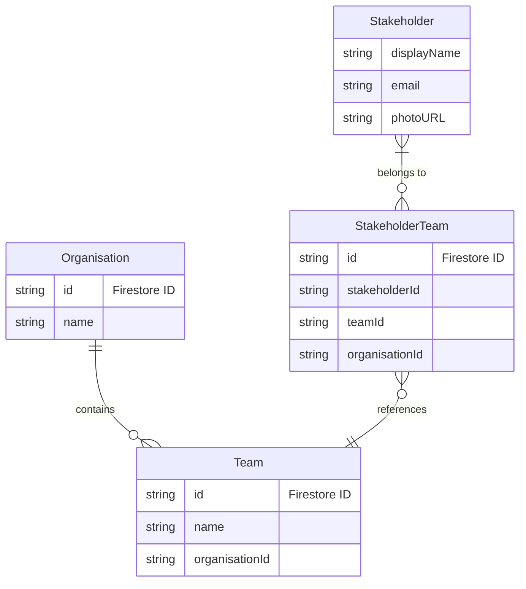
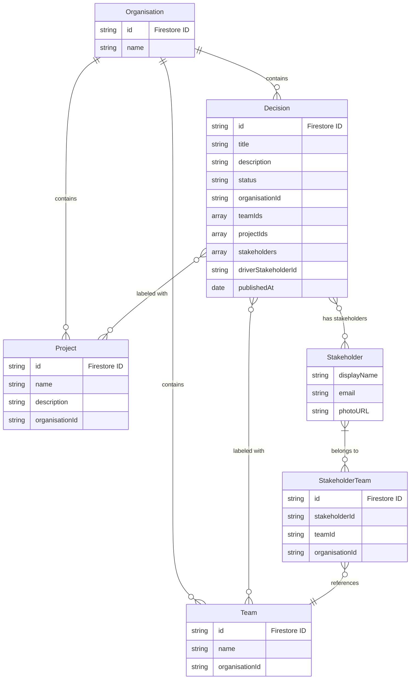

# Organisation Domain Model

## Overview

The Organisation is a top-level entity that represents a security boundary in the system. Organisations contain teams, and stakeholders can be members of multiple teams across different organisations.

### Domain Model Relationships

#### Stakeholder relationships


#### Decision relationships


## Domain Model

```typescript
interface OrganisationProps {
  id: string
  name: string
  teams: Team[]  // Teams are embedded within organisations
}

class Organisation {
  @IsString()
  readonly id: string

  @IsString()
  @MinLength(3)
  readonly name: string

  @ValidateNested({ each: true })
  @Type(() => Team)
  readonly teams: Team[]

  private constructor(props: OrganisationProps) {
    this.id = props.id
    this.name = props.name
    this.teams = props.teams.map(t => Team.create(t))
    this.validate()
  }

  static create(props: OrganisationProps): Organisation {
    return new Organisation(props)
  }

  findTeam(teamId: string): Team | undefined {
    return this.teams.find(team => team.id === teamId)
  }
}
```

## Key Concepts

### Teams
- Teams are embedded within organisations
- A team belongs to exactly one organisation
- Teams are the primary unit of access control

### Projects
- Projects belong directly to an organisation
- Projects are used as labels for decisions
- A project can be associated with multiple decisions

### Decisions
- Decisions belong directly to an organisation
- Decisions can be associated with multiple teams and projects via labels
- This flat structure reduces friction when creating decisions
- Cross-team decisions are easily represented

### Decision Model with Labels

```typescript
interface DecisionProps {
  id: string;
  title: string;
  description: string;
  status: DecisionStatus;
  organisationId: string;
  teamIds: string[]; // References to teams
  projectIds: string[]; // References to projects
  publishedAt?: Date;
}

class Decision {
  @IsString()
  readonly id: string;

  @IsString()
  @MinLength(3)
  readonly title: string;

  @IsString()
  readonly description: string;

  @IsEnum(DecisionStatus)
  readonly status: DecisionStatus;

  @IsString()
  readonly organisationId: string;

  @IsArray()
  @IsString({ each: true })
  readonly teamIds: string[];

  @IsArray()
  @IsString({ each: true })
  readonly projectIds: string[];

  @IsOptional()
  @IsDate()
  readonly publishedAt?: Date;

  private constructor(props: DecisionProps) {
    this.id = props.id;
    this.title = props.title;
    this.description = props.description;
    this.status = props.status;
    this.organisationId = props.organisationId;
    this.teamIds = props.teamIds || [];
    this.projectIds = props.projectIds || [];
    this.publishedAt = props.publishedAt;
    this.validate();
  }

  static create(props: DecisionProps): Decision {
    return new Decision(props);
  }
}
```

### Stakeholder Membership
```typescript
interface StakeholderTeamProps {
  id: string  // Firestore ID
  stakeholderId: string  // Firestore ID
  organisationId: string  // Firestore ID
  teamId: string  // Firestore ID
}
```
- Stakeholders can be members of multiple teams
- Organisation access is derived from team membership
- Stakeholder-team relationships are stored in a separate collection

## Repository Interface

```typescript
interface OrganisationsRepository {
  create(props: Omit<OrganisationProps, 'id'>): Promise<Organisation>
  getById(id: string): Promise<Organisation | null>
  getForStakeholder(stakeholderId: string): Promise<Organisation[]>
  update(organisation: Organisation): Promise<void>
  delete(id: string): Promise<void>
}
```

## Firestore Structure

```sh
organisations/
  {organisationId}/
    decisions/
      {decisionId}
    teams/
      {teamId}
    projects/
      {projectId}

stakeholderTeams/
  {stakeholderTeamId}
```

## Security Rules

```typescript
rules_version = '2';
service cloud.firestore {
  match /databases/{database}/documents {
    match /organisations/{orgId} {
      // Stakeholders can read org if they belong to any team in the org
      allow read: exists(/databases/$(database)/documents/stakeholderTeams/{stakeholderTeamId}
        where stakeholderTeamId == request.auth.uid 
        && organisationId == orgId);
      
      match /teams/{teamId} {
        // Stakeholders can read team if they are a member
        allow read: exists(/databases/$(database)/documents/stakeholderTeams/{stakeholderTeamId}
          where stakeholderTeamId == request.auth.uid 
          && organisationId == orgId
          && teamId == teamId);
      }
    }
  }
}
```

## Usage Examples

### Creating an Organisation
```typescript
const org = Organisation.create({
  id: 'org-1',
  name: 'Acme Corp',
  teams: []
})
```

### Adding a Team
```typescript
const orgWithTeam = Organisation.create({
  ...org,
  teams: [
    ...org.teams,
    Team.create({
      id: 'team-1',
      name: 'Engineering',
      projects: []
    })
  ]
})
```

### Finding a Team
```typescript
const team = org.findTeam('team-1')
if (team) {
  // Team found, do something
}
```

### Creating a Decision with Multiple Teams and Projects
```typescript
const decision = Decision.create({
  id: 'decision-1',
  title: 'Adopt TypeScript',
  description: 'We should adopt TypeScript for all new projects',
  status: DecisionStatus.DRAFT,
  organisationId: 'org-1',
  teamIds: ['team-engineering', 'team-product'],
  projectIds: ['project-website', 'project-api']
})
```

### Repository Operations
```typescript
// Get organisations for a stakeholder
const orgs = await organisationsRepo.getForStakeholder(stakeholderId)

// Create new organisation
const newOrg = await organisationsRepo.create({
  name: 'New Corp',
  teams: []
})
```

## Validation Rules

- Organisation name must be at least 3 characters
- Teams must be valid Team domain objects
- Teams array can be empty but must be present
- Decision title must be at least 3 characters
- Decision must have a valid organisation ID
- Team and project IDs must reference existing entities

## Business Rules

1. Organisations are the top-level security boundary
2. Teams can only belong to one organisation
3. Stakeholders access organisations through team membership
4. Organisation names must be unique (enforced at repository level)
5. Organisations can have multiple teams
6. Organisations can be deleted only if they have no teams
7. Decisions can be associated with multiple teams and projects
8. All members of an organisation can access all decisions in that organisation

## Error Handling

```typescript
class OrganisationError extends Error {
  constructor(message: string) {
    super(message)
    this.name = 'OrganisationError'
  }
}

// Usage
if (!org.teams.length) {
  throw new OrganisationError('Cannot delete organisation with existing teams')
}
```

## Benefits of Label-Based Approach

1. **Reduced Creation Friction**:
   - Users can create decisions without choosing a single team/project location
   - They can easily associate a decision with multiple teams/projects
   - Teams/projects can be added later as the decision evolves

2. **Improved Cross-Team Collaboration**:
   - Decisions that span multiple teams are properly represented
   - Avoids artificially forcing decisions into single-team silos
   - Better represents the reality of cross-functional decision-making

3. **Flexible Organization**:
   - Users can view decisions by team, by project, or across the organization
   - Supports both team-based and project-based workflows
