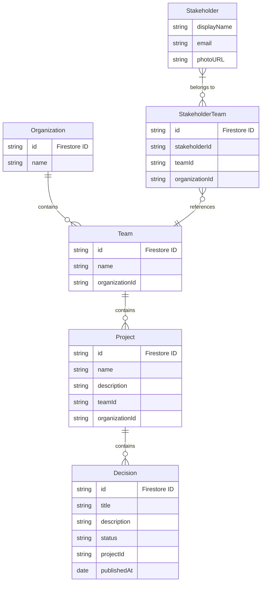

# Organization Domain Model

## Overview

The Organization is a top-level entity that represents a security boundary in the system. Organisations contain teams, and stakeholders can be members of multiple teams across different organisations.

### Domain Model Relationships



## Domain Model

```typescript
interface OrganizationProps {
  id: string
  name: string
  teams: Team[]  // Teams are embedded within organisations
}

class Organization {
  @IsString()
  readonly id: string

  @IsString()
  @MinLength(3)
  readonly name: string

  @ValidateNested({ each: true })
  @Type(() => Team)
  readonly teams: Team[]

  private constructor(props: OrganizationProps) {
    this.id = props.id
    this.name = props.name
    this.teams = props.teams.map(t => Team.create(t))
    this.validate()
  }

  static create(props: OrganizationProps): Organization {
    return new Organization(props)
  }

  findTeam(teamId: string): Team | undefined {
    return this.teams.find(team => team.id === teamId)
  }
}
```

## Key Concepts

### Teams
- Teams are embedded within organisations
- A team belongs to exactly one organization
- Teams contain projects and their associated decisions
- Teams are the primary unit of access control

### Stakeholder Membership
```typescript
interface StakeholderTeamProps {
  id: string  // Firestore ID
  stakeholderId: string  // Firestore ID
  organizationId: string  // Firestore ID
  teamId: string  // Firestore ID
}
```
- Stakeholders can be members of multiple teams
- Organization access is derived from team membership
- Stakeholder-team relationships are stored in a separate collection

## Repository Interface

```typescript
interface OrganisationsRepository {
  create(props: Omit<OrganizationProps, 'id'>): Promise<Organization>
  getById(id: string): Promise<Organization | null>
  getForStakeholder(stakeholderId: string): Promise<Organization[]>
  update(organization: Organization): Promise<void>
  delete(id: string): Promise<void>
}
```

## Firestore Structure

```sh
organisations/
  {organizationId}/
    teams/
      {teamId}/
        projects/
          {projectId}

stakeholderTeams/
  {stakeholderTeamId}
```

## Security Rules

```typescript
rules_version = '2';
service cloud.firestore {
  match /databases/{database}/documents {
    match /organisations/{orgId} {
      // Stakeholders can read org if they belong to any team in the org
      allow read: exists(/databases/$(database)/documents/stakeholderTeams/{stakeholderTeamId}
        where stakeholderTeamId == request.auth.uid 
        && organizationId == orgId);
      
      match /teams/{teamId} {
        // Stakeholders can read team if they are a member
        allow read: exists(/databases/$(database)/documents/stakeholderTeams/{stakeholderTeamId}
          where stakeholderTeamId == request.auth.uid 
          && organizationId == orgId
          && teamId == teamId);
      }
    }
  }
}
```

## Usage Examples

### Creating an Organization
```typescript
const org = Organization.create({
  id: 'org-1',
  name: 'Acme Corp',
  teams: []
})
```

### Adding a Team
```typescript
const orgWithTeam = Organization.create({
  ...org,
  teams: [
    ...org.teams,
    Team.create({
      id: 'team-1',
      name: 'Engineering',
      projects: []
    })
  ]
})
```

### Finding a Team
```typescript
const team = org.findTeam('team-1')
if (team) {
  // Team found, do something
}
```

### Repository Operations
```typescript
// Get organisations for a stakeholder
const orgs = await organisationsRepo.getForStakeholder(stakeholderId)

// Create new organization
const newOrg = await organisationsRepo.create({
  name: 'New Corp',
  teams: []
})
```

## Validation Rules

- Organization name must be at least 3 characters
- Teams must be valid Team domain objects
- Teams array can be empty but must be present

## Business Rules

1. Organisations are the top-level security boundary
2. Teams can only belong to one organization
3. Stakeholders access organisations through team membership
4. Organization names must be unique (enforced at repository level)
5. Organisations can have multiple teams
6. Organisations can be deleted only if they have no teams

## Error Handling

```typescript
class OrganizationError extends Error {
  constructor(message: string) {
    super(message)
    this.name = 'OrganizationError'
  }
}

// Usage
if (!org.teams.length) {
  throw new OrganizationError('Cannot delete organization with existing teams')
}
```
